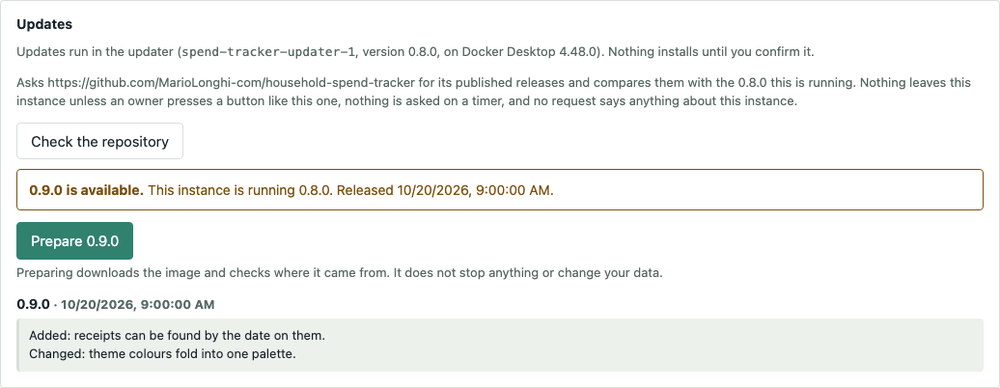
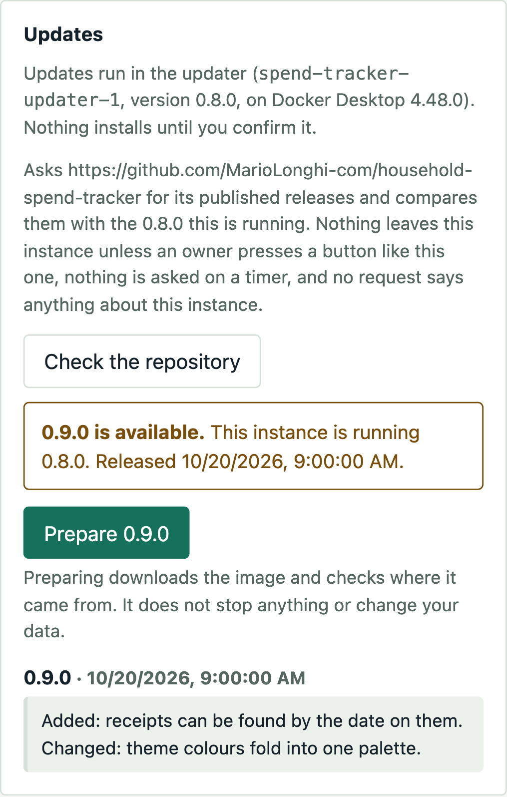
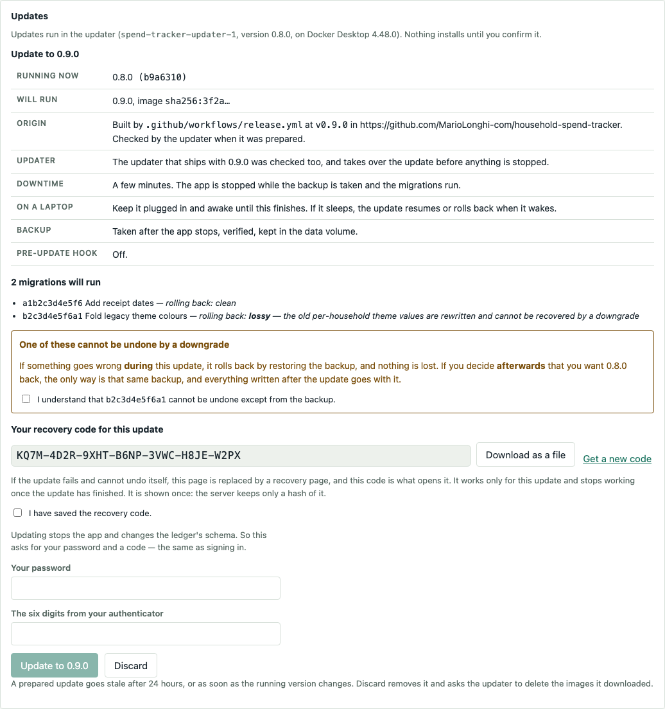

# Upgrading a running instance

This is the only operation in this project whose failure mode is
unrecoverable. Everything here exists to keep two files out of the blast
radius.

## What a deployment owns

Three things, and exactly three.

| | What it is | If it is lost |
|---|---|---|
| `spendtracker.sqlite3` **+ `-wal` + `-shm`** | the ledger | everything |
| `secret.key` | encrypts every TOTP secret | every member re-enrols their authenticator, through a recovery code or `scripts.reset_authenticator` |
| `snapshot.sqlite3` | a redacted copy for `/db` | nothing. Rebuild it with `make snapshot` |

Everything else in the directory is code, and code is replaceable by
definition.

Find them with:

```bash
make upgrade-check
```

It prints the data directory it resolved. Since 2026-09-23 the default is
outside the checkout — `~/.local/share/spend-tracker` — because `git clean
-xdf` deletes ignored files, `data/` is ignored, and that command is the
standard reflex for "my build is in a weird state, start clean". An existing
`./data` still works and is not moved.

---

## Two ways to upgrade

| You run it | Upgrade with | Section |
|---|---|---|
| **In containers, from a published release**: the release zip on your own computer, or `compose.yaml` or `deploy/tailnet/compose.yaml` on a server | the browser: *Application management → Updates* | [From the browser](#from-the-browser-container-installs) |
| **From a checkout or a release tarball**, with `make serve` | the terminal: `make upgrade` | [Do this](#do-this) |

The terminal drill is also the **fallback for a container install** when the
browser cannot do it: an image built on the box rather than pulled from a
release, a machine that cannot reach the registry, Docker Desktop's Enhanced
Container Isolation without its allowlist entry, or an updater that is gone.
[In a container](#in-a-container) has its commands. Both routes run the same
drill underneath, `scripts.upgrade`: a verified backup, the migrations, then
the checks.

---

## From the browser (container installs)

Every compose file runs a second, small container beside the app: the
**updater**. It holds the container engine's socket; the app never does. The
app writes it a request, and the updater downloads the new release, proves
where it came from, runs the drill, starts the new version, and puts the old
one back if anything fails. Nothing installs until the owner confirms it,
and nothing is fetched until the owner presses a button.

> The steps in this section use simplified technical English, as *Do this*
> below does.

### Before you start

1. Sign in as an owner. Open *Application management*. Find *Updates*.
2. Read the sentence under the heading. It must say *Updates run in the
   updater*. If it says anything else, read
   [TROUBLESHOOTING.md](TROUBLESHOOTING.md#updates-from-the-browser) first.
3. On a laptop, plug it in. Keep Docker Desktop or Podman Desktop running.

### Prepare

4. Press *Check the repository*.
5. Read the release notes. The notes of every release you skip are shown too,
   because their migrations run as well.
6. Choose the release. The newest is offered. *or choose* lists the others.
7. Press *Prepare X.Y.Z*. Wait. The app stays up. Nothing in the ledger
   changes.



<details><summary>The same at a phone's width</summary>



</details>

### Confirm

8. Read the confirmation. Read the line `rolling back:` for each migration.
9. Tick the box under each migration that cannot be undone. If you do not
   accept one, press *Discard* and stop here.
10. Save the recovery code. Press *Download as a file*, or write it down.
11. Tick *I have saved the recovery code*.
12. Type your password and a code from your authenticator.
13. Press *Update to X.Y.Z*.



### Wait

14. Keep the tab open. Keep the computer awake.
15. Wait for the page to reload. That takes a few minutes.
16. Read the outcome at the top of *Updates*.
17. Keep the backup for one day. It is listed under *Database*, in *Backups
    taken by updates*.

### What happens when you press *Update*

| | What the updater does | If that fails |
|---|---|---|
| 1 | Checks again: the app runs the version the report was prepared from, both downloaded images are present and still verify, the sidecar runs (servers), and there is disk and memory for it | *Not started*. Nothing changed. |
| 2 | Runs the pre-update hook, on a server where one is set up ([DOCKER.md](DOCKER.md#the-pre-update-hook)) | *Not started*. Nothing changed. |
| 2a | Hands over to the new release's updater first, when that one is newer | The current updater carries on itself. |
| 3 | Stops the app, renames it `…-previous` so nothing restarts it by name, and sets its restart policy to `no` so a hand start does not keep it coming back | The app is started again. *Not started*. |
| 4 | Starts the maintenance page where the app was, from the old image | |
| 5 | Runs the drill from the **new** image against your ledger: a verified backup, the migrations, the checks | Rolled back |
| 6 | Stops the maintenance page | |
| 7 | Starts the new app: a copy of the previous container, with the new image. If `…-previous` was started by hand and holds its place, it is stopped and the new app started again, once | Rolled back |
| 8 | Checks its health from where the browser's requests arrive, and that it reports the new version and commit | Rolled back |
| 9 | Pins the new release (below), keeps a record of the previous container, prunes older update backups, and makes the recovery code useless | Logged only |
| 10 | Replaces itself with the new release's updater, unless step 2a did | The updater stays on its version and says so. |

Anybody but you sees the maintenance page meanwhile: *"Spend Tracker is being
updated. It will be back in a few minutes."*, and nothing else. Your own tab
watches `/api/health` and reloads when the app answers.

**Rolled back** means: the new app is removed, the backup from step 5 is
restored **with the old image**, the previous container is renamed back,
given its own restart policy again, and started, and its health is checked. You are on the old version with the
ledger exactly as it was when the app stopped, and still signed in, because
the backup was taken after the app stopped. The outcome names the step that
failed, what the updater said and the end of the drill's log. The new image
stays on the disk, so *Prepare* can try again.

**A rollback that fails** is retried; three attempts in all. After that
nothing serves the ledger, and the maintenance page becomes the **recovery
page**: [TROUBLESHOOTING.md](TROUBLESHOOTING.md#the-recovery-page).

**A laptop that sleeps, or an engine that restarts, mid-update** is not a
failure. The updater keeps a journal of each step, and when the engine is
back it carries on from where it was, or rolls back. The drill never runs
twice. Time asleep does not count towards any deadline.

**Passkeys survive an update and a rollback.** The host name and the port do
not change, because the new container is a copy of the previous one.

### The recovery code

A code of seven groups of four characters, made for one update, shown once on
the confirmation. Only its hash goes to the updater, and the updater is what
checks it. It opens the recovery page if the update cannot undo itself, and
nothing else. It stops working when that update finishes, whichever way it
finishes, so there is never a standing code to keep safe for long. Five wrong
codes pause the recovery page for 15 minutes, and each further five double
the pause.

### The pin: `.env` names what runs

After a successful update the updater writes two lines into the compose
project's `.env`, and a copy of them into `pin/release.env` beside it:

    SPENDTRACKER_IMAGE=ghcr.io/mariolonghi-com/household-spend-tracker:X.Y.Z@sha256:…
    SPENDTRACKER_UPDATER_IMAGE=ghcr.io/mariolonghi-com/household-spend-tracker-updater:X.Y.Z@sha256:…

Both compose files name the images through these, so a later
`docker compose up -d`, a reboot or the launcher starts the release the
ledger is at, and not the older one `SPENDTRACKER_VERSION` names. **They win
over `SPENDTRACKER_VERSION`.** To upgrade by hand after a self-update, delete
both lines from `.env` and from `pin/release.env` first, or the manual
drill's new version is ignored. `compose.override.yaml` is never touched.

### Update backups

Each update's drill takes its backup into the data volume, as
`backups/<stamp>/` (for example `/var/lib/spend-tracker/backups/20261008-211100`
inside the container). The newest **five** are always kept. After a
**successful** update, older ones are deleted; a rollback deletes nothing.
*Application management → Database → Backups taken by updates* lists them with
the version that took them, downloads each as a zip `make restore` takes, and
offers *Delete* only on those older than the newest five. The server refuses
to delete one of the five whatever the browser sends.

Backups you made yourself, from the screen or with `make backup`, are not
update backups and are never deleted. A ledger that a rollback moved aside,
`spendtracker.sqlite3.before-restore-<stamp>`, stays until you remove it.

**The update backups are in the same volume as the ledger.** They protect you
from a bad migration, not from losing the volume. Download one, or take your
own off the machine ([DOCKER.md](DOCKER.md#backing-up)).

### The updater updates itself

Every release ships its own updater. When the release you install carries a
newer one, the old updater starts it beside itself, checks it can work, and
steps aside **before** the app is stopped, so the update runs on the newest
code. Otherwise it does so after the update. The old updater stays, stopped,
under its name with `-previous` added (`spend-tracker-updater-1-previous`
under Docker Compose) until the next one, and is what to start if the new one
ever stops working
([TROUBLESHOOTING.md](TROUBLESHOOTING.md#the-updater-is-not-running)). *Update the updater only*
appears after a check when a newer updater works with the version you run;
it never touches the ledger and needs no password. An updater is never
replaced by an older one.

### Going back after a successful update

There is no button for it. Going back is [Case C](#rolling-back-three-cases-and-only-one-is-easy)
whatever the migrations said: the only way back is the update's backup,
**and everything written since the update goes with it**. From a terminal, in
the compose directory, with the old version as `X.Y.Z` and the backup's stamp
from *Backups taken by updates*:

```bash
docker compose stop app
docker compose run --rm -T --entrypoint python app -m scripts.restore /var/lib/spend-tracker/backups/<stamp> --yes
```

That restore runs on the **new** image, which can read the old backup. Then,
in `.env` **and** in `pin/release.env`, change the `SPENDTRACKER_IMAGE=`
line to `SPENDTRACKER_IMAGE=ghcr.io/mariolonghi-com/household-spend-tracker:X.Y.Z`
and leave the updater's line alone: a newer updater works with an older app.
Then:

```bash
docker compose pull app
docker compose up -d
curl -s localhost:8848/api/health
```

Behind the sidecar, ask `/api/health` from inside the app as DOCKER.md
section 3 does. **A passkey registered after the update is lost**: the
restored ledger does not know it, but the member's authenticator still offers
it, and the sign-in fails without saying why. The member signs in with
password and code and removes it from the authenticator.

### When the app has not come back

The tab says so after 30 minutes. In order:

1. **On a laptop:** wake it and keep it awake. If Docker Desktop shows no
   containers at all, quit Docker Desktop fully and start it again; it can
   stay absent for many minutes after a plain reopen. With Podman, start the
   Podman machine. The update carries on when the engine is back.
2. **After an hour**, open `/recovery` on the same address and enter the
   recovery code ([TROUBLESHOOTING.md](TROUBLESHOOTING.md#the-recovery-page)).
3. **With no recovery code**, run the release zip's launcher again on a
   personal computer, or use a terminal on a server
   ([TROUBLESHOOTING.md](TROUBLESHOOTING.md#updates-from-the-browser)).

---

## Do this

The drill from a terminal, for a checkout or a tarball. A container install
uses the same steps through `docker compose`: [In a container](#in-a-container).

> The steps in this section use simplified technical English: one instruction
> per sentence, active voice, present tense. The reasoning is in the sections
> around them, not inside them. This is the part somebody follows at 23:00.

### Before you start

1. Read the upgrade report. Type `make upgrade-check`.
2. Read the line `rolling back:` for each migration.
3. If a migration is `lossy`, decide now if you accept it. You cannot undo a
   lossy migration later.
4. Make sure you can put the instance out of service for five minutes.

### Take the backup and upgrade

5. Stop the service.
6. Get the new code. Type `git fetch --tags`. Then type `git checkout v0.2.0`.
7. Install the dependencies. Type `make install-prod`. (A clone you also
   develop in uses `make install-py`, which adds the test tools.)
8. Start the upgrade. Type `make upgrade`.
9. Read what it prints. Type `upgrade` to continue.
10. Wait. The upgrade shows a maintenance page on the port while it runs.

### Check the result

11. Start the service. Type `make serve`.
12. Check the version. Type `curl -s localhost:8848/api/health`.
13. Make sure the answer shows the version you installed.
14. Open the application in a browser.
15. Sign in with your authenticator.
16. Open the register. Make sure your transactions are there.
17. Keep the backup for one day. Do not delete it when the page loads.

### If something is wrong

18. Stop the service.
19. Restore the backup. Type `make restore FROM=backups/<the folder it named>`.
20. Read the revision it prints.
21. Check out the code for that revision.
22. Start the service. Type `make serve`.

---

## Why the backup is taken the way it is

**Never copy the database file.** SQLite runs in WAL mode, so recent writes
live in `spendtracker.sqlite3-wal` until a checkpoint folds them in. In the
previous build the main file was 4 KB while the `-wal` file held 1.7 MB —
copying the one file would have produced an empty backup that nobody
discovered was empty until they needed it.

`make backup` runs:

```sql
VACUUM INTO 'backup.sqlite3'
```

which takes a consistent read of the live database *including* the WAL. That
also means it **can and should run before the service is stopped**, so a
failure to take the backup is not also an outage.

**It verifies.** It reopens the copy, reads its `alembic_version`, counts the
rows in eight tables and compares them against the live database. A backup
that was never reopened is a belief, not a backup.

**`secret.key` travels with it.** Without it the ledger restores and nobody can
finish signing in: every TOTP secret is encrypted with that file. (The
recovery codes are not: they are hashes, and they still work.)

**It runs `PRAGMA integrity_check` first.** Counting rows proves the tables are
there; it does not prove the b-tree is intact, and a copy that did not finish
writing can still answer a `count(*)` off the pages it has.

**It checks the key against the database.** After an upgrade, `make upgrade`
takes one real sealed TOTP secret out of the upgraded database and opens it
with `secret.key`. The failure this catches is specific and nasty: the wrong
key leaves every row perfectly readable and every authenticator refused, and
nothing surfaces it until somebody tries to sign in — which on a
single-household instance can be days.

**The copy is self-describing.** A `VACUUM INTO` copy carries its own
`alembic_version` table, so the file knows which revision it was taken at.
That is what tells a future operator which tag to check out. `manifest.json`
beside it records the app version, the row counts and a SHA-256.

### Keeping several, and sending one off-site

```bash
make backup
python -m scripts.backup --keep 3
python -m scripts.backup --method backup --into /mnt/offsite
```

- `make backup` — one, into `./backups/<stamp>/`
- `python -m scripts.backup --keep 3` — another, then prune to the newest three

`--keep` prunes **after** the new copy has been verified, never before. A
script that prunes first and then discovers its fresh copy is unreadable has
turned one bad backup into no backups.

`--method backup` exists because of a measurement in the project's private
hosting notes, taken against a real 725 MiB database with two
snapshots a simulated week apart — 2.5 MiB of genuinely new data:

| method | blocks reused | new bytes for week two |
|---|---:|---:|
| `VACUUM INTO` | 8.1% | **666 MiB** |
| `.backup` (online backup API) | **98.5%** | **11.2 MiB** |

**`VACUUM INTO` repacks the database**, so page contents shift and almost
nothing lands where it did last week. `restic`, `borg`, Time Machine and every
incremental cloud sync therefore store the whole thing again — a 266×
amplification on the new data.

That is not a reason to stop using it locally: it is compact, self-describing,
and is what the rolling three wants. It *is* the reason to put `--method
backup` underneath anything that deduplicates.

## Rolling back: three cases, and only one is easy

> [!important]
> **The round-trip test proves *shape*, not *data*.**
> `test_downgrade_then_upgrade_is_clean` walks `head → base → head` on an
> **empty** database and asserts the schema matches the models. It proves every
> `downgrade()` runs without erroring. It says nothing whatsoever about whether
> a downgrade preserves the rows.

**Case A — no migration in the release.** Check out the old tag and restart.
The data is untouched and `schema_check` passes because the head never moved.
Free.

**Case B — a migration ran and its downgrade is faithful.** `make upgrade-check`
called it `clean`. Run `alembic downgrade <old head>`, check out the old tag,
restart.

**Case C — a migration ran and its downgrade is lossy.** `make upgrade-check`
called it `lossy` and named what it destroys. `downgrade()` restores the
*shape* and cannot restore the *content*. The only honest rollback is restoring
the backup — and everything written since the upgrade is then gone as well.

Every migration in this repository declares which it is, in its own docstring,
and `tests/test_upgrade_drill.py` fails if one does not. That is why the
report can be trusted: nothing is silently undeclared.

## The audit log does not cover migrations

> [!danger]
> **"Undo that import" will not undo a bad migration.**

Every write to an audited table goes through a batch, the `before_flush` hook
raises if it does not, and the before-images in `changes` are what makes undo
work. That is protection against a **person's** mistake.

Alembic runs DDL and raw SQL on a plain connection — no ORM session, no flush,
no hook. The audit log never sees it. `e1f3a77c04b2` rewrites every household's
theme and there is no `batches` row for it anywhere.

**The backup is the only thing standing between a bad migration and a lost
ledger.** This project's strongest feature invites exactly the wrong assumption
here, which is why it is said in bold rather than left to be inferred.

## What `make upgrade` will not do for you

**It does not stop or start your service.** systemd, a container, a terminal
somebody left running and `tailscale serve` are four different answers and
guessing wrong is worse than asking. It refuses to run while the port is still
answering, and says so.

**It does not `git pull`.** Which commit to deploy is a decision. A script that
makes it while also migrating a database is a script whose mistakes are two
deep.

**It does not delete your backups.** They accumulate under `backups/` until you
remove them. That is deliberate: disk is cheaper than a ledger.

## In a container

**[`DOCKER.md`](DOCKER.md) has this in full**, with the exact commands. The
short version:

The volume is untouched by an upgrade, by construction — the data cannot be
inside the thing being replaced, because the thing being replaced is an image.

**The volume belongs to the Compose project, and the project is pinned.**
`compose.yaml` sets `name: spend-tracker`, so the ledger lives in the volume
`spend-tracker_ledger` whatever the checkout's directory is called. Without
that line Compose names the project after the directory: a fresh clone into
`household-spend-tracker/` would get a new, empty
`household-spend-tracker_ledger` beside the old one and open on the setup
wizard, which is indistinguishable from data loss. If you run an older
checkout whose `compose.yaml` has no `name:`, check `docker volume ls` before
the first `up` in a new directory, and pass `-p <old project name>` until you
have moved over.

```bash
docker compose run --rm -T -v "$PWD/backups:/backups" \
  --entrypoint python app -m scripts.backup --into /backups
(cd "$(git rev-parse --show-toplevel)" && python3 -m scripts.build_stamp)
docker compose build
docker compose run --rm -T --entrypoint python app -m scripts.upgrade --check
docker compose stop app
SPENDTRACKER_AUTO_MIGRATE=1 docker compose up -d
```

`-T` matters: without it `docker compose run` allocates a TTY and a
non-interactive shell gets no output at all. `--entrypoint python` matters
because the image's entrypoint is the server.

The entrypoint **does not migrate unattended**. A restart is not a decision to
change a schema, and `restart: unless-stopped` would otherwise make every crash
a fresh chance to run a migration nobody was watching. Set
`SPENDTRACKER_AUTO_MIGRATE=1` when you mean it. Without it, `schema_check`
refuses to boot against a database that is behind or ahead and says which
revision each side is at — which is the correct behaviour for a container that
came back at 04:00. The one database a start migrates by itself is one with
no tables at all, a brand-new volume, because there is nothing in it to lose.

## A backup downloaded from the Application screen

*Application management → Back the database up* writes a bare `.sqlite3`
into `data/backups`, and each one downloads as a zip (#133):

    spendtracker-<stamp>/
        spendtracker.sqlite3
        manifest.json
        README.txt
        secret.key        only if "Include secret.key" was ticked, which
                          asks for your password and a code (#204)

`make restore` takes the zip as it is, with no need to unzip it. It takes the
bare `.sqlite3` too:

```bash
make restore FROM=~/Downloads/spendtracker-20260925T112800Z.zip
make restore FROM=data/backups/spendtracker-20260925T112800Z.sqlite3
make restore FROM=elsewhere.zip KEY=/path/to/secret.key
```

**Which key it uses, in order:** the one in the zip; the one named by `KEY=`;
the one already in the data directory, left where it is. The last is right
when putting a backup back onto the instance that made it, and wrong
anywhere else. So whichever it picks, restore **opens a real authenticator
secret in the backup with it before moving anything**, and refuses if it
cannot. `--without-key` (run `python -m scripts.restore` directly) restores
anyway, for a key that is truly lost; every member then needs a new
authenticator, through one of their recovery codes or, with none left,
`scripts.reset_authenticator` ([TROUBLESHOOTING.md](TROUBLESHOOTING.md#4-secretkey-is-lost-or-wrong)).

**Download without the key unless it is going somewhere only you can open.**
With the key and a member's password, the zip is enough to sign in as that
member once restored. That is why the box is off by default and not
remembered.

## Passkeys and the host name

A passkey works only for the host name it was registered under. That name is
`SPENDTRACKER_RP_ID`, which by default is the host of `SPENDTRACKER_PUBLIC_URL`.
An upgrade does not change it, and nor does a restore onto the same host.
**These do change it**:

- a restore onto a machine with another name;
- a renamed machine or tailnet;
- a move between the two Tailscale layouts in DOCKER.md;
- a move to a custom domain.

The passkey rows come back with the ledger in every case, but none of them
works any more, and the sign-in screen does not say why.

`make upgrade-check` and `make restore` say so before you go ahead, and
`make doctor` says so afterwards. Each prints one line per name, for example
"2 passkeys registered for old.example.ts.net, this instance is
new.example.ts.net".

Nothing is lost that cannot be redone:

1. Each member signs in with their password and code.
2. They remove the stranded passkeys in Sign-in methods, where they are marked.
3. They register new ones.

If you can, choose the name before anyone registers a passkey, and keep it.

## Rehearse a restore, once, for real

Before the first deployment that matters: take a backup, deliberately destroy
the database, restore it, sign in, and **write down how long it took**.

A restore procedure that has never been executed is a document, not a
capability. The time it takes is the number that decides, during a real
incident, whether restoring is even on the table.

| | |
|---|---|
| Rehearsed on | *(not yet — fill this in)* |
| Took | |
| By | |
