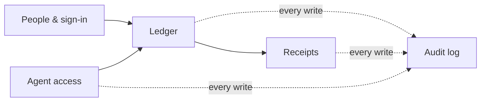

# The data model

This page describes how Spend Tracker stores its data: the ideas that shape
the schema, and the groups the tables fall into. It leaves out table and
column names on purpose so it stays true as the schema changes. For exact
tables and columns, read `app/models/`; each model's docstring explains why
that table exists.

Everything lives in **one SQLite database** (WAL mode), and Alembic manages
its schema. There is no second store. Receipt images are in the same file,
so a `VACUUM INTO` copy backs up everything (see
[Backing up, and upgrading](../README.md#backing-up-and-upgrading)).

## The groups

### Ledger

These are the books themselves. A **household** is one set of books. It
holds **accounts**, the **payees** money goes to and comes from, a two-level
tree of **categories**, and **rules** that turn a bank's description of a
line into a payee you recognise. **Transactions** are the only records of
money. Every balance, report and register view is computed from them.

Some ledger records describe how the outside world names things: the IBANs,
card numbers and file tags a bank uses, which the importer matches to decide
which account a statement belongs to. Others record a deliberate act that
can't be recomputed afterwards, such as a bank's stated closing balance when
an account is reconciled.

A few shapes appear throughout:

- **A transfer is two transactions**, one on each account, pointing at each
  other. Across currencies the two amounts differ and the rate is kept
  exactly, as text. Each leg also says how the link was made -- a row named
  the other account, a person chose it, or only account history suggested
  it -- because only the first two count as history for the next match.
  Pairs a person has said are *not* a transfer are recorded too, so they are
  never offered again.
- **A split replaces the transaction it divides.** The parts share a grouping
  id and there is no parent row, so no sum has to know splits exist.
- **Transactions the app creates for itself**, such as opening balances and
  transfer legs, are marked in the schema rather than identified by a name
  someone could change. Reports rely on that marking to leave them out of
  income and spending.

### Receipts

Receipts are evidence attached to transactions. A receipt record holds what
people change (which transaction it belongs to, a note) and what the camera
recorded (when, where, which device), parsed into columns. The image bytes
are stored separately, keyed by their hash, so identical files are stored
once. A receipt with no transaction is in the inbox. Deleting a transaction
moves its receipts back to the inbox rather than destroying them.

### Audit log

Every change to the ledger belongs to a **batch**, which is one operation
such as an import, a split, a reconciliation or a manual edit. For each row
it touched, the batch records the full row before and after. That is what
History shows and what Undo replays in reverse. An import also keeps a
verdict for every line of the file (created, duplicate, skipped, and so on),
so a line that changed nothing can still be explained later.

### People & sign-in

Users, their second factor and recovery codes, and invitations. The rest of
this group records what happened at the door rather than to the ledger:
sessions, sign-ins halfway through, trusted browsers, fresh identity checks
for sensitive actions, and sign-in attempts for rate limiting. Housekeeping
sweeps these rows once they expire.

### Agent access

Keys a member issues so a program can act on their behalf in one household,
a log of every request each key made (including reads, which the audit log
doesn't see), and stored replies so a retried request gets the same answer
instead of doing the work twice. See [`agent/README.md`](../agent/README.md).

## Principles

**Money is an integer.** Amounts are signed whole numbers in the minor units
of the account's own currency, so −2661 on a euro account is −€26.61. There
are no floats and no currency conversion anywhere in the ledger.

**Store the decision, compute its effects.** Balances, whether a key is still
valid, when an idle session expires and what a receipt's download is called
are all computed when read. The database keeps what someone chose, and facts
that can't be recomputed.

**Every table says whether it is audited.** A model that doesn't declare it
fails at import. Tables that describe the ledger are audited. Tables that
record sign-in activity, or that would bloat the log (image bytes), are
deliberately left out.

**Deletes go through the application, never around it.** Child rows are
removed by cascades in SQLAlchemy's object-relational mapper (ORM), which the
audit hook can see. Any database-level path that would delete rows behind its
back is blocked (`RESTRICT`), because a silent cascade is a change the log
never recorded and an undo can't restore.

**Every identifier exists before the row is written.** Primary keys are random
hex UUIDs assigned when the object is created, so the audit log can refer to
a row in the same transaction that inserts it.

**Secrets are stored as hashes and kept out of the log.** Session cookies,
trusted-device tokens, invitations and agent keys are stored only as
SHA-256, so looking one up is the check. Password and second-factor columns
are left out of audit images, so an undo can never restore an old
credential.

**An import can't land twice.** Every imported transaction carries a key
derived from the bank's own id, or failing that from the line's amount,
date, running balance and position. The database refuses a second copy of
the same key on the same account.

**Every table is classified for the snapshot.** The browsable `/db` copy
(see [Looking at the database](../README.md#looking-at-the-database)) empties,
redacts or carries each table whole. A new table blocks the snapshot until
someone decides which.

## What the log doesn't cover

Migrations run outside the object-relational mapper (ORM), so they leave no
batch and can't be undone from inside the app. Take a backup before
upgrading; the [upgrade drill](../deploy/UPGRADING.md) covers this.
